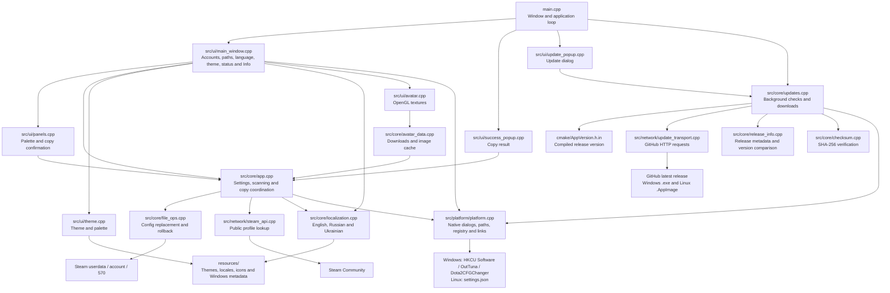

# Dota 2 Config Manager

[](https://github.com/OutTuna/Dota2CFGChanger/actions/workflows/build.yaml)
[](https://github.com/OutTuna/Dota2CFGChanger/releases/latest)
[](#getting-started)
[](#a-few-details)
[](LICENSE)

Copy your Dota 2 settings from one Steam account to another. Pick the account with the setup you want, choose the destination, and confirm the copy.

[Download](https://github.com/OutTuna/Dota2CFGChanger/releases) · [Issues](https://github.com/OutTuna/Dota2CFGChanger/issues) · [Roadmap](docs/TODO.md) · [Русский](#русский)

## Getting started

Download `DotaManager.exe` for Windows or `Dota2_CFG_Changer-x86_64.AppImage` for Linux from the releases page. Themes and translations are built in; there is no installer or extra resource folder to download.

On Linux, make the AppImage executable before opening it:

```sh
chmod +x Dota2_CFG_Changer-x86_64.AppImage
./Dota2_CFG_Changer-x86_64.AppImage
```

Both platforms need a working OpenGL driver. The Linux folder picker uses `zenity` or `kdialog`, and the interface needs a system font such as DejaVu, Liberation or Noto. macOS is not supported.

1. Close Dota 2 and Steam before copying.
2. Check the source and destination folders. The app tries to find Steam's `userdata` directory, including Linux Flatpak installations. You can choose another folder manually.
3. Click **Scan folders**.
4. Select the source account on the left and the destination account on the right.
5. Click **Copy config** and confirm.

The folders should follow Steam's layout: `<root>/<account_id>/570/`. You can use the same `userdata` root for both lists, or a saved copy as the source. Only the selected account's `570` directory is replaced.

**Keep a separate backup of any settings you want to keep.** The app prepares the new files before replacing the destination and attempts to restore the old directory if the replacement fails. After a successful copy, the temporary backup is removed. If interrupted files remain, resolve them before trying again; the app will show the affected paths.

## A few details

- English is the default language. Switch between **RU / UA / EN** at the top right, immediately beside the theme selector. Language and theme are saved automatically.
- Dark is the default theme; five themes are included. The Crimson theme also has a palette editor. A local `themes/` folder can override the built-in themes; missing or invalid resources fall back to the embedded ones.
- Account names and avatars come from public Steam Community profiles and are cached locally. This needs an internet connection, but no Steam login or API key. If a profile lookup fails, the account ID still appears in the list.
- Release builds check for updates at startup. You can also check using the button at the bottom of the window. Downloading starts only when you click **Download**; the app checks the file size and SHA-256 before keeping it. If a verified download is unavailable, use **Open release**. Launch the new file yourself after closing the old version.

On Windows, paths, theme and language are saved under `HKEY_CURRENT_USER\Software\OutTuna\Dota2CFGChanger`, in the `Settings` value. An existing `settings.json` is migrated and removed only after a successful registry write. Profile caches, avatars and updates still use `%APPDATA%\DotaManager`. On Linux, settings and caches use `$XDG_CONFIG_HOME/DotaManager` / `~/.config/DotaManager`.

## Building

You need Git, CMake 3.14+, a C++17 compiler and internet access for the first configuration. CMake fetches the pinned dependencies: Dear ImGui, GLFW, cpr/libcurl, nlohmann/json and stb.

On Debian or Ubuntu, install the development packages first:

```sh
sudo apt install build-essential cmake git libgl1-mesa-dev libx11-dev \
  libxrandr-dev libxinerama-dev libxcursor-dev libxi-dev libssl-dev
```

From a Visual Studio developer terminal on Windows, or a shell on Linux:

```sh
git clone https://github.com/OutTuna/Dota2CFGChanger.git
cd Dota2CFGChanger
cmake -S . -B build -DCMAKE_BUILD_TYPE=Release
cmake --build build --config Release --parallel
```

With the Visual Studio generator, the result is `build/Release/DotaManager.exe`. On Linux it is `build/DotaManager`; the GitHub Actions workflow handles AppImage packaging. CI publishes the Windows `.exe` and Linux `.AppImage` as a stable Latest release, checks the compiled version and caches dependencies between builds. Linux jobs use Ubuntu 24.04; official Actions use Node.js 24.

For a versioned local build, pass `-DAPP_VERSION=x.y` when configuring. The default `0.0` development build skips the startup update check.

To build and run the C++ checks:

```sh
cmake -S . -B build -DCMAKE_BUILD_TYPE=Release -DDOTAMANAGER_BUILD_TESTS=ON
cmake --build build --config Release --parallel
ctest --test-dir build -C Release --output-on-failure
```

## How the code fits together

`main.cpp` runs the window. `src/ui/` draws the interface, while `dotamanager_core` handles scanning, config replacement, profile data and updates without depending on ImGui or OpenGL. `src/ui/avatar.cpp` uploads the images from `src/core/avatar_data.cpp` as OpenGL textures. Theme and translation resources are embedded during the build.

```text
main.cpp              application entry point
src/core/             settings, scanning, config files, caches and updates
src/network/          Steam and release HTTP requests
src/platform/         native paths, dialogs, fonts and external links
src/ui/               windows, panels, themes and OpenGL avatars
resources/            icons, themes, translations and Windows metadata
cmake/                resource embedding
scripts/              development and CI checks
tests/                regression checks
docs/                 roadmap
```

The AppImage uses the checked-in PNG icon. CI does not need an image converter.

[Open the full diagram in GitDiagram](https://gitdiagram.com/outtuna/dota2cfgchanger).

<details>
<summary>Project diagram</summary>



</details>

## Русский

Программа переносит настройки Dota 2 между Steam-аккаунтами. Скачайте `.exe` для Windows или `.AppImage` для Linux из [релизов](https://github.com/OutTuna/Dota2CFGChanger/releases). Темы и переводы уже внутри.

Закройте Dota 2 и Steam, проверьте пути к `userdata` и запустите сканирование. Слева выберите аккаунт с нужными настройками, справа — тот, куда их перенести. Нажмите кнопку копирования и подтвердите замену.

Копируется папка `<account_id>/570` целиком. Если старые настройки нужны, сохраните их отдельно: после успешной замены временная резервная копия удаляется.

Язык RU / UA / EN и тема выбираются справа сверху и сохраняются автоматически. Dark — тема по умолчанию. Внизу находятся статус, Info и проверка обновлений; Info показывает автора, номер релиза и ссылку GitHub. Имена и аватарки загружаются из Steam Community без входа в аккаунт. При наличии обновления появится окно; файл скачивается только по нажатию. После загрузки закройте старую версию и запустите новую.

## License

[MIT](LICENSE). OutTuna.

## Testers

Thanks for testing builds and helping catch UI issues:

- [Qoudanna](https://github.com/Qoudanna)
- [ciqparis](https://github.com/ciqparis)
- [paradisetears](https://github.com/paradisetears)
